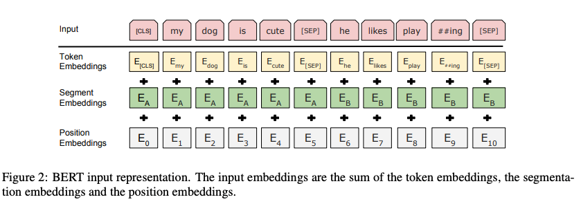
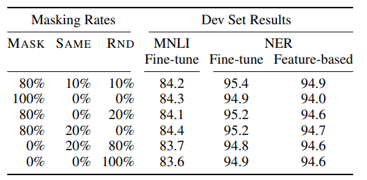
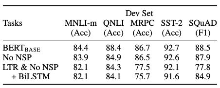
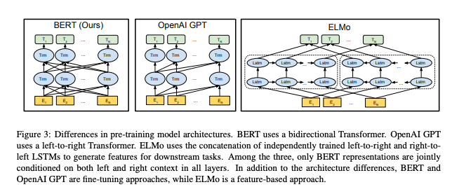

# BERT:Pre-training of Deep Bidirectional Transformers for Language Understanding Review

- Conference : NAACL
- Link :

[BERT: Pre-training of Deep Bidirectional Transformers for Language Understanding](https://arxiv.org/abs/1810.04805)

- Year : 2018
- 저자 : Jacob Devlin, Ming-Wei Chang, Kenton Lee, Kristina Toutanova
- Github :

[https://github.com/google-research/bert](https://github.com/google-research/bert)

- 동영상 :

[https://vimeo.com/365139010](https://vimeo.com/365139010)

# BERT란?

Bidirectional Encoder Representations from Transformers. 

Unlike recent language representation models.

BERT is designed to pre-train deep bidirectional representations from unlabeled text by jointly conditioning on both left and right context in all layers.

As a result, the pre-trained BERT model can be fine tuned with just one additional output layer to create state-of-the art models for a wide range of tasks, such as question answering and language inference, without substanial task specific architecure modifications.

# 핵심 요약

- trasformer의 encoder network를 기반으로, self-attention을 이용하여 bidirectional하게 언어 특성을 학습합니다.

    - transformer란?
    
    transformer는 the mechanism of self-attention**을 채택하는 딥 러닝 모델로서, 입력 데이터의 각 부분의 중요성을 차등적으로 가중시킨다. 주로 자연어 처리(NLP)와 컴퓨터 비전(CV) 분야에서 사용된다.**
    
    - transformer background
    
    before transformers, most state-of-the-art NLP systems relied on gated RNNs, such as LSTM and gated recurrent units (GRUs), with added attention mechanisms. Transformers are built on these attention technologies without using an RNN structure, highlighting the fact that attention mechanisms alone can match the performance of RNNs with attention.
    
    transformer 이전에 대부분의 최첨단 NLP 시스템은 LSTM과 게이트 반복 유닛(GRU)과 같은 게이트 RNN에 의존했으며 주의 메커니즘이 추가되었다. 변압기는 RNN 구조를 사용하지 않고 이러한 주의 기술을 기반으로 구축되어 주의 메커니즘만으로도 RNN의 성능을 주의와 일치시킬 수 있다는 사실을 강조한다.
    
    - Encoder
    
    Each encoder consists of two major components : a self-attention mechanism and a feed-forward neural network. The self-attention mechanism accepts input encodings from the previous encoder and weighs their relevance to each other to generate output encodings.
    
    각 인코더는 self-attention mechanism과 feed-forward neural network 이라는 두 가지 주요 구성 요소로 구성된다. 자체 주의 메커니즘은 이전 인코더로부터 입력 인코딩을 받아들이고 출력 인코딩을 생성하기 위해 서로 관련성을 평가한다.
    
    참조 : [Transformer (machine learning model) - Wikipedia](https://en.wikipedia.org/wiki/Transformer_(machine_learning_model)?msclkid=a821d608bd7b11ec9cad602d05a50e33)
    
    [Attention Is All You Need](https://arxiv.org/abs/1706.03762)
    
    참조 : 
    
    [https://www.youtube.com/watch?v=mxGCEWOxfe8](https://www.youtube.com/watch?v=mxGCEWOxfe8)
    
- MLM(Masked language model)과 NSP(next sentence prediction)등의 pre-training방법을 제시하였습니다.
    - MLM
    
    In order to train a deep bidirectional representation, we simply mask some percentage of the input tokens at random, and then predict those masked tokens.
    
    deep bidirectional representation을 훈련시키기 위해 입력 토큰의 일부 비율을 무작위로 마스킹한 다음, 마스킹된 토큰을 예측한다.
    
    참조 : 
    
    [](https://aclanthology.org/2020.acl-main.240.pdf?msclkid=3edd2a0dbe0211ecab2f655db1333859)
    
    - NSP
    
- pre-training방법으로 feature representation을 학습한 뒤 fine-tuning만으로 down-stream task를 수행합니다.

# Introduction & Related Work

저자는 먼저 사전 훈련을 통해 자연어 처리 Task의 성능을 향상 시키는 PLM(pre-trained language model)의 사례를 제시합니다.

- Feature-based
    - 예시)ELMo : pre-trained representation 을 추가 특성으로 사용하여 Task에 특화된 모델 구조를 설계합니다.
- fine-tuning
    - 예시) GPT : task에 특화된 파라미터를 최소화 하고, 사전 학습된 파라미터 전부를 fine-tuning 합니다.

두 방식 모두 pre-training에서 동일한 objective를 사용하고, unidirectional language model을 가정합니다. 이 때문에, 문맥을 단 방향으로만 습득하게 되어, 양방향의 문맥 이해가 필요한 문답 task 등의 성능을 보장하지 못함을 지적합니다.

이에 논문은, fine-tuning 방식을 개선하는 PLM으로 BERT(Bidirectional Encoder Representations from Transformers) 구조를 제안합니다. BERT의 pre-training은 masked language model(MLM) 과 next-sentence-prediction task(NSP)를 통해 양방향 문맥을 학습하게 됩니다.

# BERT

![출력 계층을 제외하고, 사전 훈련과 미세 조정 모두에서 동일한 아키텍처가 사용된다. 동일한 사전 훈련된 모델 매개 변수는 다양한 다운스트림 작업에 대한 모델을 초기화하는 데 사용된다. 미세 조정 중에는 모든 파라미터가 미세 조정됩니다. [CLS]는 모든 입력 예제 앞에 추가된 특수 기호이고 [SEP]는 특수 구분 토큰(예: 질문/답변 구분)입니다.](BERT_Pre-t/Screen_Shot_2021-11-24_at_11.39.40_PM.png)

출력 계층을 제외하고, 사전 훈련과 미세 조정 모두에서 동일한 아키텍처가 사용된다. 동일한 사전 훈련된 모델 매개 변수는 다양한 다운스트림 작업에 대한 모델을 초기화하는 데 사용된다. 미세 조정 중에는 모든 파라미터가 미세 조정됩니다. [CLS]는 모든 입력 예제 앞에 추가된 특수 기호이고 [SEP]는 특수 구분 토큰(예: 질문/답변 구분)입니다.

BERT는 크게 pre-training 단계와 fine-tuning 단계, 두가지 단계로 구분하며, 각 단계는 모두 동일한 모델 구조를 공유합니다.

Pre-training 단계에서는 레이블링 하지 않는 데이터를 기반으로 학습을 진행합니다.

Fine-tuning에서는 pre-trained 파라미터로 초기화된 모델을 레이블링된 데이터로 학습합니다.

## Model Architecture

BERT의 구조는 다층레이어로 구성된 양방향 Transformer의 Encoder를 기본으로 하며, 아래와 같은 표기로 모델 속성을 나타내었습니다.

- L : Layer 갯수 (ex : Transformer Block)
- H : Hidden size
- A : self-attention head 의 갯수

논문에서는 크게 두 모델을 제시합니다.

- BERT-BASE : L = 12, H = 768, A = 12, 총 파라미터 수 = 110M (GPT 와 동일)
- BERT-LATGE : L = 24, H = 1024, A = 16, 총 파라미터 수 = 240M

## Input/Output Representations

실제 사용하는 다양한 task에 사용할 수 있도록, 단일 문장과 쌍으로 이어진 문자을 모두 하나의 Sequence 로 표현합니다. 단어 임베딩으로는 WordPiece embedding 을 사용하며 30,000개의 token vocalbulary를 사용합니다.



Input은 Token embedding + Segment embedding + Position embedding 으로 구성됩니다.

- Token Embedding
    - Sequence 의 첫 토큰은 [CLS]토큰을 사용합니다.
    - 두 문장이 이어진 경우, [SEP]토큰으로 문장을 구분하며, 마지막에도 [SEP] 토큰을 추가합니다.
        - [CLS]는 모든 입력 예제 앞에 추가된 특수 기호이고 [SEP]는 특수 구분 토큰(예: 질문/답변 구분)입니다.
- Segment Embedding
    - 두 문장이 있을 때, 각각의 문장에 sentence A / sentence B 임베딩을 적용합니다.
- Positional Embedding
    - Transformer 의 삼각함수 Encoding 이 아닌, lookup table 에서 각 position의 vector들을 찾아서 Position 을 embedding합니다.

# Pre-training BERT

전통적인 left-to-right / right-to-left LM 을 사용해서 pre-train 하는 ELMo, GPT와는 다르게, BERT는 2개의 unsupervised task를 이용해서 사전학습을 수행합니다.

## Task #1 : Masked LM

기존의 언어 모델을 Bidirectional 하게 처리하는 경우, 간접적으로 예측하려는 단어를 참조할 수 있게 되어 예측 자체가 무의미해질 수 있음을 지적합니다.

BERT는 전체 Sequence 에서 15%의 토큰을 가리는 Mask 를 추가하여 양방향 학습의 문제를 해결하였습니다.

또한, 사전 훈련 모델이 [MASK] 토큰을 사용하지 않는 Fine-tuning에도 적용될 수 있도록 하는 Masking Rule을 제시합니다.

- 80%는 [MASK]로 치환

```
my dog is hairy -> my dog is [MASK]
```

- 10%는 랜덤한 토큰으로 치환

```
my dog is hairy -> my dog is apple
```

- 10%는 기존의 토큰을 그대로 사용

```
my dog is hairy -> my dog is hairy
```

이로 인해 model은 단어의 기원(원본/MASK/random changed)을 알지 못한 채 모든 input token에 대해서 distributional contextual representation을 유지하게 됩니다. 또한 전체의 1.5% 토큰만이 랜덤하게 변경되었기에, 모델이 잘못 학습될 우려 또한 적음을 제시합니다.



이러한 비율은 위의 실험을 통해 제시되었습니다.

- 전체적으로 fine-tuning task 가 feature-based 보다 좋은 성능을 보임
- 특정 Masking Rule 만을 사용하는 것이 아닌, Rule 혼합이 더 좋은 성능을 보임

최종적으로는 cross-entropy loss 를 사용해서 기존의 토큰을 예측하도록 학습합니다.

## Task #2: Next Sentence Prediction (NSP)

- Many important downstream tasks such as Question Answering (QA) and Natural Language Inference (NLI) are based on understanding  he relationship between two sentences, which is not directly captured by language modeling. In order to train a model that understands sentence relationships, we pre-train for a binarized next sentence prediction task that can be trivially generated from any monolingual corpus. Specifically, when choosing the entences A and B for each pretraining example, 50% of the time B is the actual next sentence that follows A (labeled as IsNext), and 50% of the time it is a random sentence from the corpus (labeled as NotNext). As we show in Figure 1, C is used for next sentence prediction (NSP).
    
    <aside>
    💡 문장 관계를 이해하는 모델을 훈련하기 위해, 우리는 모든 단일 언어 말뭉치에서 사소한 것으로 생성될 수 있는 이항화된 다음 문장 예측 작업을 위해 사전 훈련한다. 구체적으로, 각 사전 훈련 예에 대한 문장 A와 B를 선택할 때, 시간의 50%는 A를 따르는 실제 다음 문장(IsNext로 레이블링됨)이고, 50%는 말뭉치(NotNext로 레이블링됨)의 무작위 문장이다. 그림 1에서 알 수 있듯이, C는 다음 문장 예측(NSP)에 사용된다.
    
    </aside>
    

Question-answering(QA), Natural Language Interference(NLI) 등의 task는 두 문장 사이의 관계를 이해해야 하는 task입니다. 일반적인 LM 으로는 해당 Task 의 학습이 어려우므로, 이 또한 학습을 진행합니다.

두 문장과 레이블로 구성된 다음의 데이터 셋으로 Binary 분류 문제를 학습합니다.

- 50% : 실제로 이어진 두 문장을 제시 : 레이블 IsNext
- 50% : 관계가 없는 임의의 문장을 제시 : 레이블 NotNext

### Pre-training data

사전 훈련을 위해 사용한 corpus 를 제시합니다.

- BooksCorpus (800M words)
- English Wikipedia (2,500M words) :  text passage 만 사용했고, 목록이나 표 등은 제외하여 사용

긴 문맥을 학습하기 위해서 Billion Word Benchmark 와 같이 섞인 문장으로 구성된 데이터는 사용하지 않았습니다.

## Fine-tuning BERT

Task 별 입력의 개수(단일 문장, 2개의 문장)에 따라 하나의 sequence 를 생성하여 입력으로 사용합니다.

이후, 파라미터들을 해당 task에 맞게 end-to-end로 업데이트합니다.

Sequence tagging 이나 question answering 같이 token-level task 들의 경우, 마지막 transformer layer의 token 들을 사용하여 fine-tuning 합니다.

Sentence Classification, sentiment analysis 등의 sentence-level classification task 들은 마지막 layer의 CLS token의 hidden state를 fine-tuning에 이용합니다.

Pre-training과 비교했을 때, fine-tuning 은 빠르게 학습이 가능합니다.

# Experiments

BERT fine-tuning을 이용한 11개의 NLP task의 결과를 제공합니다. 모든 Task 에서 State-Of-Arts 를 달성하였고, 각각의 특성에 맞는 학습 방법을 제시합니다.

.png)

## GLUE

GLEU benchmark는 다양한 natural language understanding task를 위한 문장 분류 Task 입니다. BERT 모델에 분류를 위한 classification layer를 추가합니다.

## SQuAD v1.1

SQuAD v1.1 dataset은 Question Answering dataset으로, 질문과 지문의 형태 주어진 데이터에서 답변을 찾는 과제입니다. BERT 는 질문과 지문을 하나의 single sequence 로 묶어서 input으로 만든 뒤, 지문에서 정답이 될 수 있는 영역을 찾는 방식으로 Task 를 전환해 학습합니다.

## SQuAD v2.0

SQuAD v2.0 은 1.1 과 유사하지만, 지문만으로는 대답이 불가능한 질문이 포함된 dataset 입니다. BERT 는 대답이 불가능한지 여부를 CLS token 을 이용해 분류하는 문제를 추가합니다.

## SWAG

The Situations With Adversarial Generations (SWAG) dataset은 앞 문장이 주어졌을 때, 보기로 주어진 4 문장 중 가장 잘 어울리는 문장을 찾는 task 입니다.

Fine-tuning 을 위해, 앞 뒤 문장을 조합해 4개의 문장을 생성하고, 해당 sequence 의 정답 여부를 Classification 하는 Task 를 수행합니다. 

# Ablation Studies

## Effect of Pre-training Tasks



사전 훈련의 효과를 확인하기 위해, 훈련을 제거하며 실험한 결과를 제시합니다.

- No NSP : masked LM(MLM) 으로만 학습되고 NSP는 사용하지 않는 경우
    - NLI 문제에서 성능이 하락
    - NSP 가 문장간의 논리적인 구조 파악에 중요한 역할을 수행함을 시사
- LTR & No NSP : MLM이 아닌 Left-To-Right model 을 사용하고 NSP도 사용하지 않는 경우
    - 모든 task에 대해서 성능이 감소하며, 특히 MRPC와 SQuAD 에서 큰 폭의 성능 저하를 확인
- LTR & No NSP + BiLSTM : BiLSTM 을 추가하여 양방향성을 제공
    - BiLSTM 이 없는 경우에 비해 미미하게 성능이 상승하지만, MLM 에 비해서는 떨어짐
    - MLM이 bi-directionality 가 더 강함을 시사

## Effect of Model size

.png)

모델의 크기가 fine-tuning 정확도에 어떠한 영향을 주는지를 확인합니다.

- 모델이 커질수록, Pre-training 의 정확도가 상승
- downstream task 가 작은 스케일의 데이터셋을 사용할 때에도 성능이 상승

## Feature-based Approach with BERT

BERT를 ELMo 와 같은 feature-based 로 사용하는 방식과 그 장점을 제시합니다.

- task-specific model 의 추가로 Transformer encoder 만으로 수행 불가능한 task에 적용 가능
- Update parameter 감소로 학습 비용 절감

.png)

CoNLL-2003 Named Entity Recognition task 로 성능을 평가합니다.

BERT 레이어의 일부 activation 에 Bi-LSTM을 부착시켜 해당 레이어만 학습시키는 방식으로 Feature-based approach 를 구현하였고, 기존 ELMo 에 비해서도 좋은 성능을 보입니다.

또한 Fine-Tuning 방법만을 사용하였을 때도, SOTA 에 근접한 결과를 얻었음을 제시합니다.



참조 : 

[https://www.youtube.com/watch?v=30SvdoA6ApE](https://www.youtube.com/watch?v=30SvdoA6ApE)

# Conclusion

- RNN은 순차적으로 계산한다면 Transformer는 한번에 계산.
- BERT는 Transformer를 이용해서 양방향의 문맥을 숫자의 형태로 바꿔주는 딥러닝 모델이다.